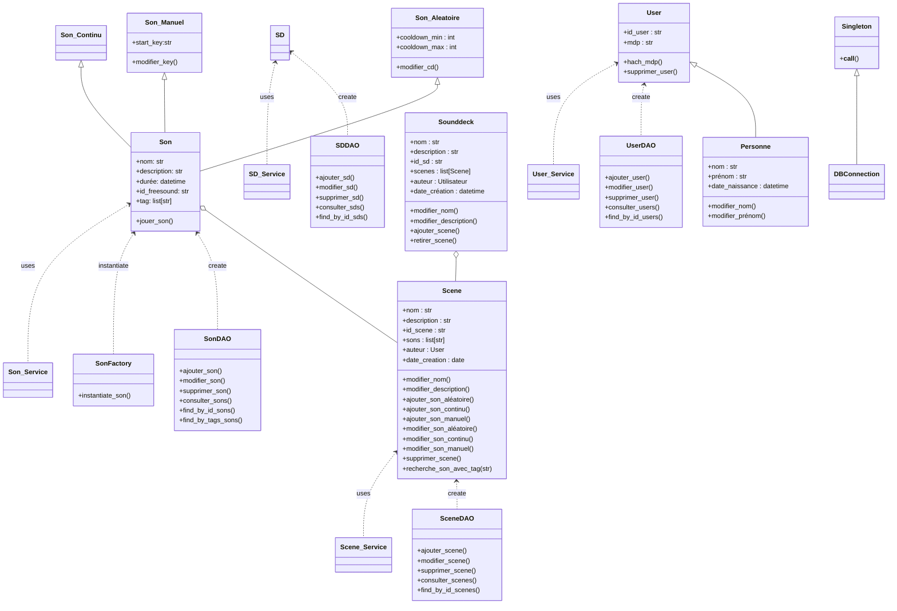

```mermaid
classDiagram

%% Classes DAO
    class SonDAO {
        +ajouter_son()
        +modifier_son()
        +supprimer_son()
        +consulter_sons()
        +find_by_id_sons()
        +find_by_tags_sons()
    }

    class SceneDAO {
        +ajouter_scene()
        +modifier_scene()
        +supprimer_scene()
        +consulter_scenes()
        +find_by_id_scenes()
    }

    class SDDAO {
        +ajouter_sd()
        +modifier_sd()
        +supprimer_sd()
        +consulter_sds()
        +find_by_id_sds()
    }

    class UserDAO {
        +ajouter_user()
        +modifier_user()
        +supprimer_user()
        +consulter_users()
        +find_by_id_users()
    }

    class SonFactory {
        +instantiate_son()
    }

%% Classes OBJET
    class Son {
        +nom: str
        +description: str
        +durée: datetime
        +id_freesound: str
        +tag: list[str]
        +jouer_son()
    }

    class Son_Aleatoire {
        +cooldown_min : int
        +cooldown_max : int
        +modifier_cd()
    }

    class Son_Manuel {
        +start_key:str
        +modifier_key()
    }

    class Son_Continu {
    }

    class Scene {
        +nom : str
        +description : str
        +id_scene : str
        +sons : list[str]
        +auteur : User
        +date_creation : date
        +modifier_nom()
        +modifier_description()
        +ajouter_son_aléatoire()
        +ajouter_son_continu()
        +ajouter_son_manuel()
        +modifier_son_aléatoire()
        +modifier_son_continu()
        +modifier_son_manuel()
        +supprimer_scene()
        +recherche_son_avec_tag(str)
    }

    class Sounddeck {
        +nom : str
        +description : str
        +id_sd : str
        +scenes : list[Scene]
        +auteur : Utilisateur
        +date_création : datetime
        +modifier_nom()
        +modifier_description()
        +ajouter_scene()
        +retirer_scene()
    }

    class Personne {
        +nom : str
        +prénom : str
        +date_naissance : datetime
        +modifier_nom()
        +modifier_prénom()
    }

    class User {
        +id_user : str
        +mdp : str
        +hach_mdp()
        +supprimer_user()
    }

%% Classes Services

    class Singleton{
        +__call__()
    }

    class DBConnection{
    }

    class Son_Service{

    }

    class User_Service{

    }

    class Scene_Service{

    }

    class SD_Service{

    }

    %%Liens Objets
    Son_Aleatoire <|-- Son
    Son_Manuel <|-- Son
    Son_Continu <|-- Son
    User <|-- Personne
    Sounddeck o-- Scene
    Son o-- Scene

    %%Liens DAO
    User <.. UserDAO : create
    Son <.. SonDAO : create
    Scene <.. SceneDAO : create
    SD <.. SDDAO : create
    Son <.. SonFactory : instantiate

    %%Liens Services
    Singleton <|-- DBConnection
    Son <.. Son_Service : uses
    Scene <.. Scene_Service : uses
    SD <.. SD_Service : uses
    User <.. User_Service : uses

```
