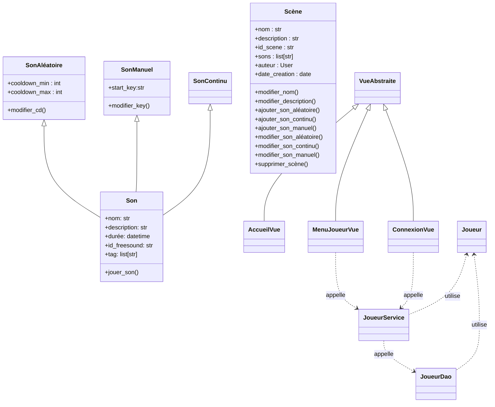

```mermaid
classDiagram
    class Son {
        +nom: str
        +description: str
        +durée: datetime
        +id_freesound: str
        +tag: list[str]
        +jouer_son()
    }
    
    class Son Aléatoire {
        +cooldown_min : int
        +cooldown_max : int
        +modifier_cd()
    }
    
    class Son Manuel {
        +start_key:str
        +modifier_key()
    }

    Son Aléatoire <|-- Son
    Son Manuel <|-- Son
    Son Continu <|-- Son

    class Scène {
        +nom : str
        +description : str
        +id_scene : str
        +sons : list[str]
        +auteur : User
        +date_creation : date
        +modifier_nom()
        +modifier_description()
        +ajouter_son_aléatoire()
        +ajouter_son_continu()
        +ajouter_son_manuel()
        +modifier_son_aléatoire()
        +modifier_son_continu()
        +modifier_son_manuel()
        +supprimer_scène()
    }


    VueAbstraite <|-- AccueilVue
    VueAbstraite <|-- ConnexionVue
    VueAbstraite <|-- MenuJoueurVue
    MenuJoueurVue ..> JoueurService : appelle
    ConnexionVue ..> JoueurService : appelle
    JoueurService ..> JoueurDao : appelle
    Joueur <.. JoueurService: utilise
    Joueur <.. JoueurDao: utilise
```
